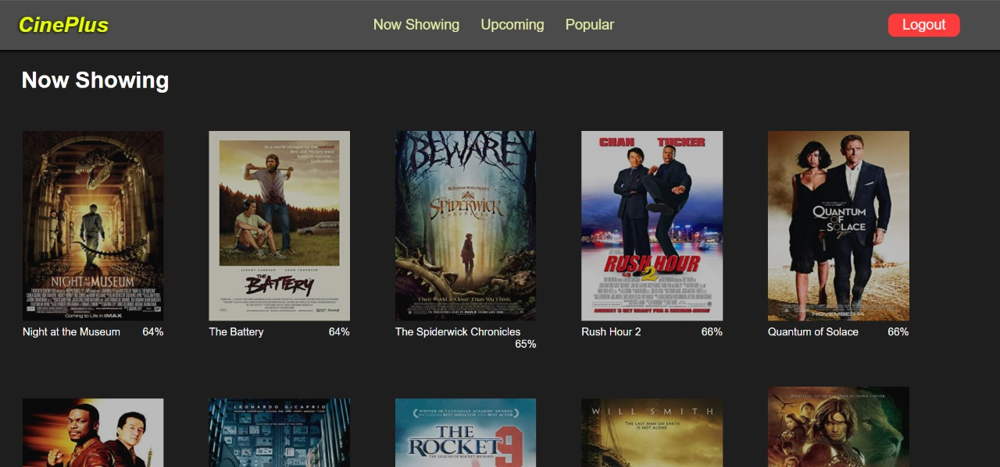
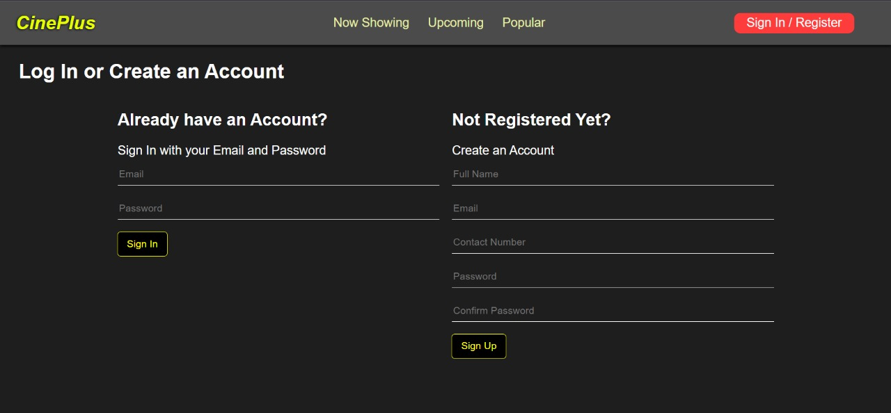
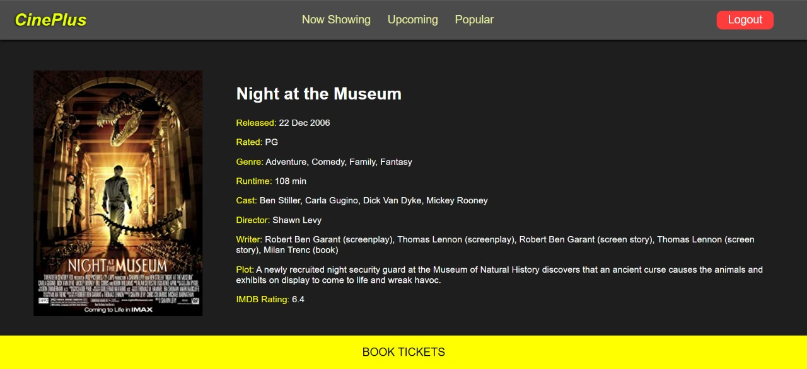
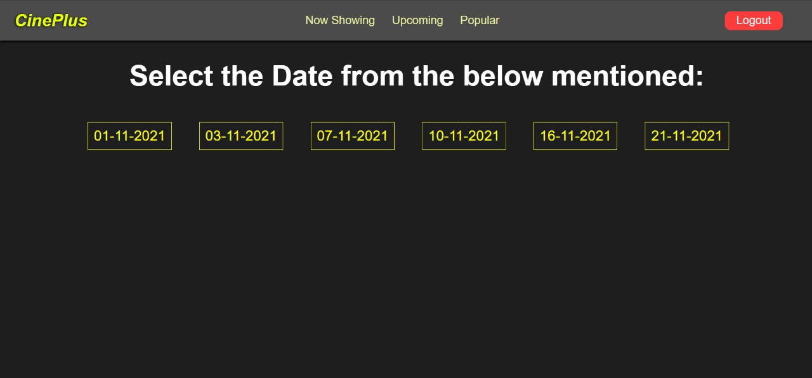
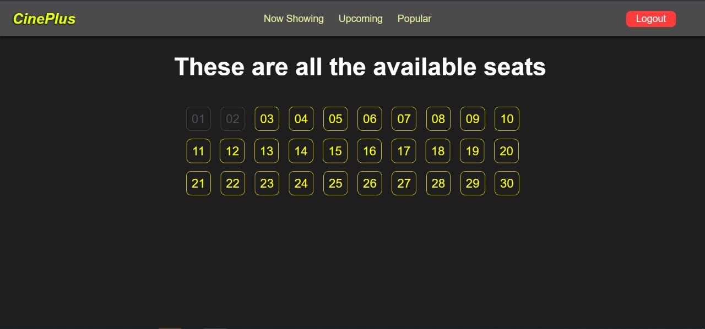

# CinePlus

A movie web application developed with the MERN stack.

## Description

This app will let you browse through the movies. It will give you the information movies and you will be able to book seats, choosing the date and time for the shows.

**Features**
 [✔] User authentication.
 [✔] Book Movies.
 [✔] Make Payment
 [✔] View Movie Details

## Development

A Website implemented using MERN (MongoDB, ExpressJS, ReactJS and NodeJS) stack and allows users to sign-in/register and book movie tickets online.

## Configuration Steps
1. Cloning the repository:
```
$ git clone https://github.com/ahmedgulabkhan/MovieGo.git
```
2. Run the commands:
```
$ cd CinePlus
$ npm install

$ cd backend
$ npm install

$ cd..

$ cd fronted
$ npm install
```
3. dotenv file:
Create a .env file in the backend folder, and write the following code
```
SECRET=12345
```
## Screenshots
##### Home Page


##### Sign in and sign up


##### Movie Details




## Future Scope
1. User will be able to book multiple tickets at once.
2. Different categories of seats like platinum,silver etc.
3. Emails can be sent to the users whenever the payment is successful with the QR code.

## Contributors
1. Chaitanya Chaniyara - 1911005
2. Rohan Balasubramanian - 1911044
3. Ayush Singh- 1911058
